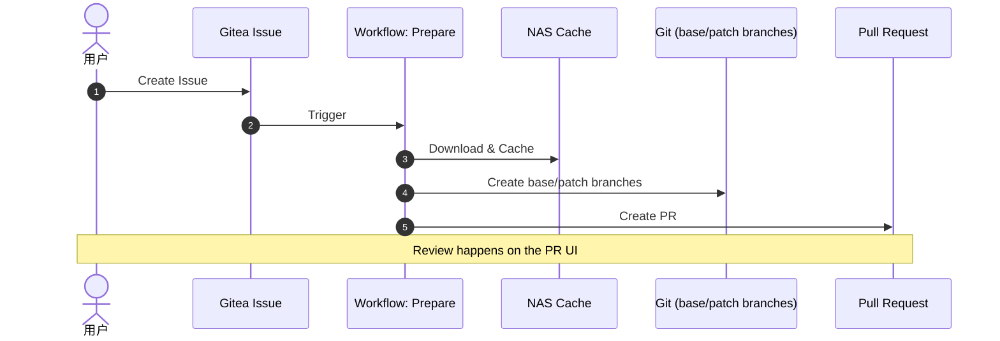
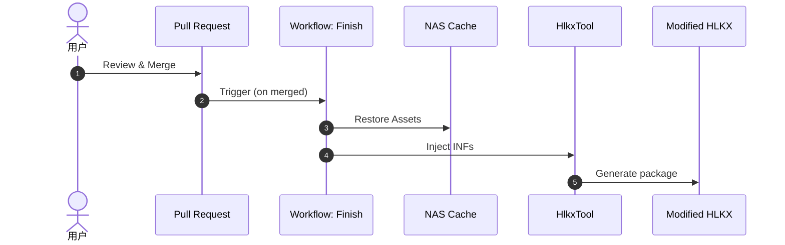
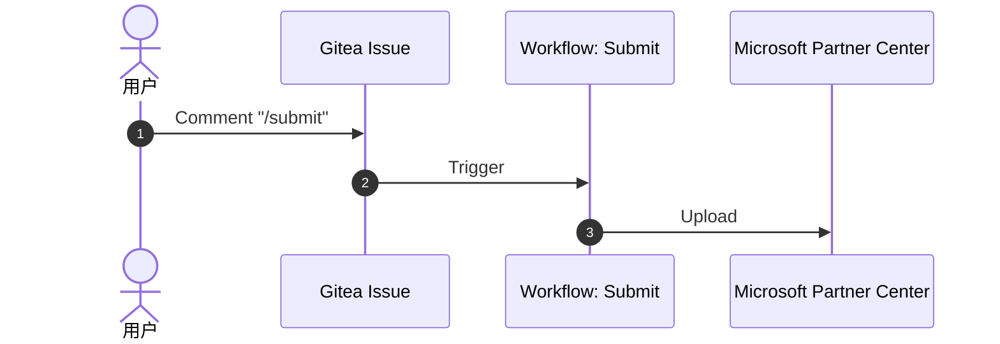

# DUA 自动化处理与提交系统 (IssueOps)

本项目实现了一套基于 **Gitea Actions** 和 **PowerShell** 的全自动化 DUA (Driver Update Acceptable) 处理流程。系统引入了 **IssueOps** 理念，通过 Issue 驱动流程，结合 Git 的版本控制能力进行人工审查，确保 INF 修改的准确性与可追溯性。

---

## 📚 用户指南 (User Guide)

本指南面向 **Driver SA** 及相关开发人员。

### 1. 创建 DUA 请求
1.  进入 Gitea 仓库的 **Issues** 页面。
2.  点击 **New Issue**，选择 **DUA Request** 模板。
3.  填写以下信息：
    *   **Project Name**: 项目代号 (例如 `chogori`)。
    *   **Product ID**: 微软 Partner Center 中的产品 ID (例如 `1234567890`)。
4.  点击 **Create Issue** 提交。

> **提示**: 提交后，系统会自动启动 **Prepare** 流程，从 Partner Center 下载驱动，并根据规则自动修改 INF 文件。

### 2. 审查修改 (Review)
1.  等待几分钟，Bot 会在 Issue 中留言，并指派一个 **Pull Request (PR)** 给你。
2.  点击链接进入 PR 页面。
3.  点击 **Files Changed** 标签页。
4.  **仔细审查 INF 文件的变更**：
    *   系统会自动创建一个 `patch` 分支包含修改后的 INF。
    *   你需要确认这些修改（如 DevID 替换、OS 版本修改等）是否符合预期。

### 3. 完成处理 (Finish)
1.  确认无误后，点击 PR 页面底部的 **Merge Pull Request** 按钮。
2.  系统会自动触发 **Finish** 流程：
    *   将修改后的 INF 注入原始驱动。
    *   更新 HLKX 包。
    *   打包最终产物。
3.  完成后，Bot 会在 Issue 评论区发布 **成功消息**，包含最终 HLKX 包的下载链接 (位于 NAS)。

### 4. 提交至微软 (Submit)
1.  确认产物无误后，在 Issue 的评论区回复以下指令：
    ```text
    /submit
    ```
2.  系统将自动把生成的 HLKX 包上传至 Microsoft Partner Center。
3.  上传成功后，Bot 会回复提交状态。

---

## 🏗️ 架构与原理 (Architecture & Principles)

本系统采用 **Prepare -> Review -> Finish -> Submit** 的四阶段设计。

### 流程图解

#### 1) Prepare 阶段（Issue -> PR）



#### 2) Finish 阶段（PR merged -> 产物生成）



#### 3) Submit 阶段（Issue comment /submit -> 上传 Partner Center）



### 核心机制

1.  **IssueOps**:
    *   所有状态流转通过 Issue 和 PR 的状态（Open/Merged/Closed）来驱动。
    *   Issue 存储元数据 (Product ID)，PR 存储代码变更 (INF Diff)。

2.  **Git 作为审查界面**:
    *   由于 HLKX 是二进制文件，无法直接审查。
    *   系统将 INF 文件提取出来，利用 Git 的 Diff 功能让用户审查文本变更。
    *   `.gitattributes` 配置确保 UTF-16LE 编码的 INF 文件能被正确 Diff。

3.  **缓存机制 (NAS)**:
    *   驱动包和 HLKX 文件通常较大（数百 MB 到 GB），不适合直接存入 Git。
    *   **Prepare 阶段**将大文件缓存至 `\\nas\labs\RUNNER\tmp\issue-<ID>`。
    *   **Finish 阶段**从该路径恢复文件，仅应用 Git 中的 INF 修改。

4.  **路由与策略**:
    *   `config/mapping/product_routing.json`: 根据产品名决定处理策略 (Pipeline)。
    *   `config/inf_patch_rules.json`: 定义具体的 INF 修改规则 (正则替换)。

---

## 🚀 部署与配置 (Deployment)

如果你需要在一个新的 Gitea 实例或 Runner 上部署此系统，请遵循以下步骤。

### 1. 环境要求
*   **Gitea Instance**: 支持 Gitea Actions。
*   **Runner**: Windows Runner，标签需设置为 `RUNNER-WHQL`。
*   **Network**: Runner 需要能访问：
    *   Gitea Server
    *   Microsoft Partner Center API (互联网)
    *   内部 NAS (`\\nas\labs`)
*   **Tools**: Runner 需预装 PowerShell 7+ 和 Git。

### 2. 密钥配置 (Secrets)
在 Gitea 仓库的 `Settings -> Actions -> Secrets` 中配置以下密钥：

| 密钥名称 | 描述 |
| :--- | :--- |
| `BOTTOKEN` | Gitea 机器人的 Access Token，用于操作 Issue/PR/Repo。 |
| `MS_CLIENT_ID` | Microsoft Partner Center AAD App Client ID。 |
| `MS_CLIENT_SECRET` | Microsoft Partner Center AAD App Client Secret。 |
| `MS_TENANT_ID` | Microsoft Partner Center AAD Tenant ID。 |
| `DUA_TEAMS_WEBHOOK_URL` | (可选) Teams 通知 Webhook URL。 |

### 3. 环境变量
部分配置通过 `1_ParseConfig.ps1` 中的逻辑硬编码或文件配置，主要包括：
*   **NAS 路径**: 默认为 `\\nas\labs\RUNNER\tmp`，如需修改请调整 `Common.psm1` 或相关 Step 脚本。

---

## 📂 目录结构 (Directory Structure)

```text
dua/
├── .gitea/
│   ├── workflows/           # Gitea Workflow 定义 (YAML)
│   │   ├── dua_prepare.yml  # 准备阶段：下载、分支、PR
│   │   ├── dua_finish.yml   # 完成阶段：打包、清理
│   │   ├── dua_submit.yml   # 提交阶段：上传到微软
│   │   └── ...
│   └── ISSUE_TEMPLATE/      # Issue 模板
├── config/
│   ├── mapping/             # 产品路由配置
│   └── inf_patch_rules.json # INF 修改规则库
├── scripts/
│   ├── modules/             # PowerShell 公共模块
│   │   ├── Gitea.psm1       # Gitea API 封装
│   │   ├── PartnerCenter.psm1 # 微软接口封装
│   │   ├── InfPatch.psm1    # INF 处理逻辑
│   │   └── ...
│   ├── steps/               # 原子化步骤脚本 (被 Workflow 调用)
│   └── tools/               # 外部工具 (如 HlkxTool.exe)
└── tests/                   # 单元测试
```

---

## ❓ 常见问题 (Troubleshooting)

### Q: PR 创建失败，Issue 中没有反应？
*   **检查**: 查看 Gitea Actions 的 `DUA Prepare` 运行日志。
*   **常见原因**:
    *   Product ID 错误，导致无法从 Partner Center 下载。
    *   NAS 路径不可写。
    *   Token 过期。

### Q: 提交 (/submit) 后提示失败？
*   **检查**: 查看 `DUA Submit` 日志。
*   **常见原因**:
    *   微软接口偶尔超时，可尝试重新评论 `/submit` 重试。
    *   Submission ID 状态不正确（如已被锁定）。

### Q: 修改了 INF 但最终包里没生效？
*   确保你是在 Bot 创建的 `patch` 分支上修改，并且 **Merge** 成功了。
*   Finish 流程如果报错，可能会导致旧文件未被覆盖。
